# Moodle Developer Gradup/block Installation Guide
Congratulations! You made it through the first instructions and now have a Moodle environment setup on your windows Computer! The next step is to install Gradup (or any other block plugin) into your dev environment. 

1.	__The first step is a quick explanation of moodle’s file structure. Moodle’s online documentation contains a lot of information, but assuming you followed the previous instructions, you should have a folder containing the following files:__  
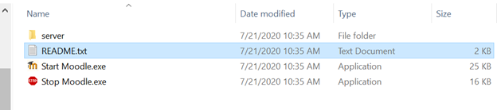

2.	__First open up the “server” directory (it should be self explanatory that you do not rename this folder btw – just don’t please) This folder contains all the files for your moodle dev environment:__  
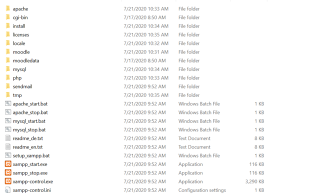

3.	__Notice that most of these files are supporting software (eg/ apache/mysql/php etc..) but not actually part of moodle (this would look different in a production environment running on a server for example) However, two of these folders are relative to your development journey: “moodle” and “moodledata”.__ 
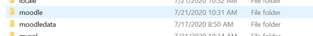

4.	__Moodle data contains the database settings and basically stuff in the background used by moodle. What we want is the “moodle” folder. Open the moodle folder and you should see:__
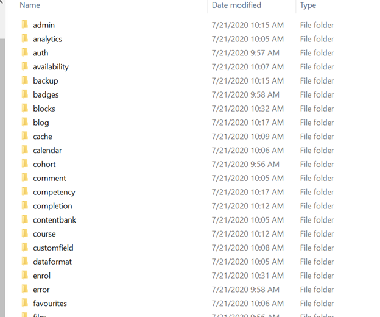

5.	__A Bunch of files used by moodle. The online moodle docs provide details on most of these but for plugin development we are primarily concerned with two folders: “mod” and “blocks”. The “mod” folder is for differnet modules used by moodle, if you want to develop different modules you would be using this folder, however, for gradeup and other blocks, we only care about the “blocks” directory.__
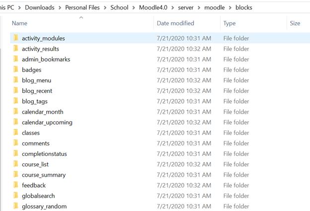

6.	__Once inside the “blocks” directory, let’s open any block to get an idea of what a typical block structure looks like: (In this case we’re going to open “badges”):__
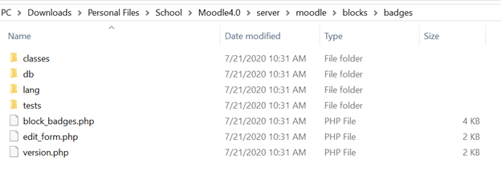

7.	__Inside badges there are two directories and two files that we are going to care about: “db” “lang” “block_badges.php” and “version.php”__

    1.	“db”: this folder contains the changes that need to be made to add new fields to the moodle database, if your block is adding some new point system for grades for example, or a new data field, this   folder will contain the files that do that (gradeup doesn’t have any of these files but many plugins do)

    2.	“lang”: this folder contains files for plugin support in other languages. If you open this file you will see an “en”( for “English”) directory and inside that directory a “block_badges.php” file that     contains string variables matched to the English translation. Moodle uses these variables in code development to allow easy multilanguage support. (open this file and just get an idea of the format for how   moodle does this – if you have strings in your plugin you will need to use this method instead of hard coding them so your plugin can be translated later. The “block_badges.php” file in this directory is   always named “block_BLOCKNAME.php”

    3.	“block_badges.php”: this file is like the “main()” of your plugin, look at a few different plugins at this file to get an idea of how it works, but at least the start of your plugin has to start here.    The file name format is always”block_BLOCKNAME.php”
    d.	“version.php”: this file is used by moodle to detect version changes to your plugin and is required for your plugin to work or be installed. There are several parts of this plugin but only three of them  are critical:
    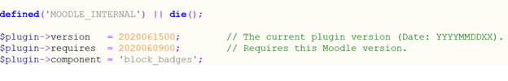

        *	Version: what version of your plugin this is (this is an integer value formatted YYYYMMDDHH) when this number is incremetented, moodle will detect that your file has an update, and will pull in changes       to the entire plugin
        *	Requires: this says what version of moodle is required for your plugin to work, similar format to version
        *	Component: defines the name of your plugin should be “block_BLOCKNAME” 	

8.	__Now to have moodle install your block: simply drag and drop the “gradeup” folder (or any other block folder) into the …/server/moodle/blocks directory__
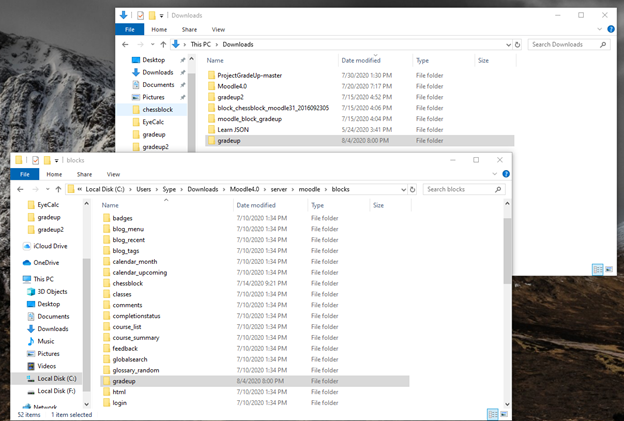

9.	__Now the block is technically installed, but in order for moodle to update you might need to go to the http://127.0.0.1/admin/index.php page and select “check for available updates” button__
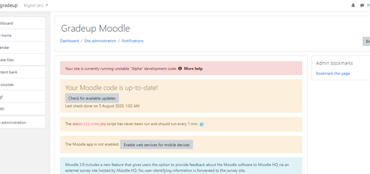

10.	 __After you select the button, moodle will first perform several server checks, then look for new versions of existing plugins and look for new plugins:__
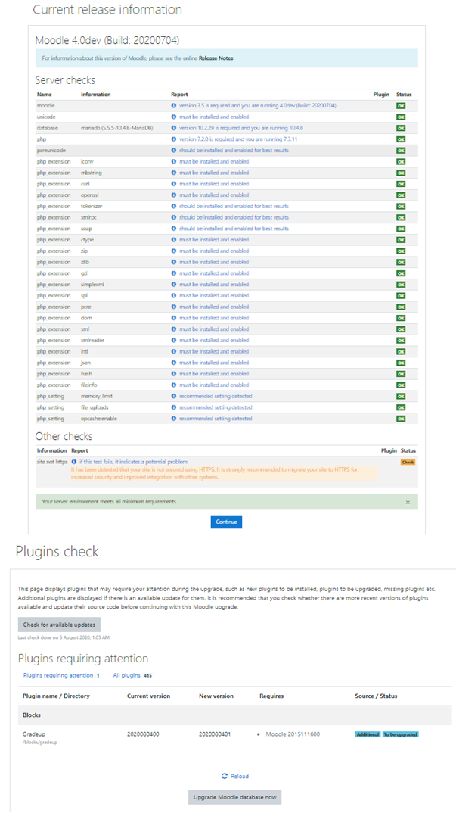

11.	 __Select “Upgrade Moodle database now” and moodle will install the block__

12.	__To then add the block to your moodle dashboard, select “customize this page”__
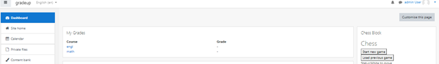

13.	__This will then make the “add a block”button visible” select it and it will bring up a list of blocks available:__
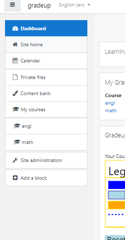

14.	__Add the Gradeup Block and you are done: (you may need to move it to the center of the page using the moving arrows if it spawns on the right of the screen)__
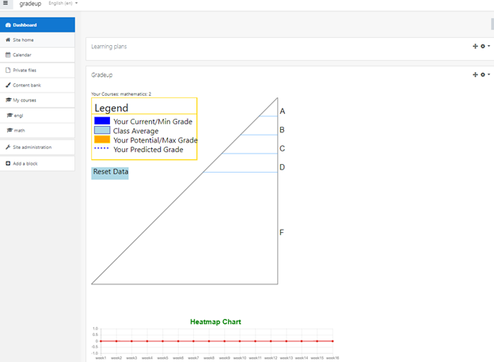
