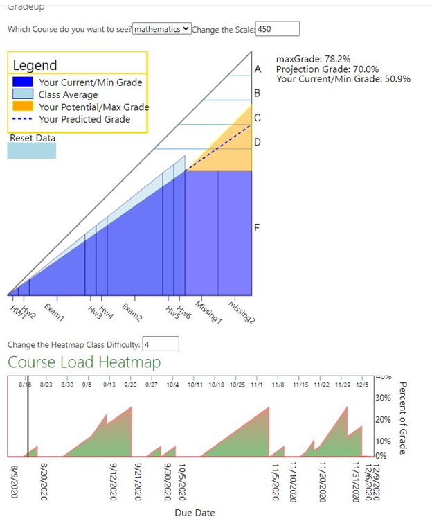

# Setup Moodle Course Environment

1. __Create three new users: student1, student2, teacher__

	1. go to Site Administration -> Settings -> Users > Accounts and select "Add new users" (editing must be turned on in the settings section for this to work)
   
	2. on the Add new user page, fill out the required fields, once done select create user (make sure you set a user password as you will be logging in and out of these accounts for the tests

2. __Create a new course:__
   
	1. go to Site Administration -> Courses -> Add a new course

	2. enter a full and short name (Mathematics and Math) and 
		* set the start to:  August 10, 2020
		* set the end date to: December 10, 2020
		* click save and display
	3. Now select ""enrol Users" find the admin account and add it as a manager to each of your courses

	4. select the two student accounts and add them as students

	5. select the teacher account and add as a teacher

3. __now let's add some assignments to the course:__

   _Go to the homepage of the course and turn editing on_
    1.	as either the admin or teacher account, select "add an activity or resource”

    2.	Select “assignment”
    
    3.	Create the following Assignments with the following due Dates and Maximum Grades:

        Assignment Name | Maximum Points | Due Date
        ----------------|----------------|----------
        HW1	            |10	             |August 20, 2020
        HW2	            |10	             |September 10, 2020
        Exam1           |50              |September 20, 2020
        HW3	            |10	             |September 30, 2020
        HW4	            |10	             |Oct 5, 2020
        Exam2           |50	             |Nov 5, 2020
        HW5	            |10	             |Nov 10, 2020
        HW6	            |10	             |Nov 20, 2020
        Missing1        |30              |Nov 30, 2020
        Missing2        |30              |December 6, 2020

4. __now log in as the teacher account and grade the assignments as follows:__

   1. first go to the course page (math)
   
   2. select the assignment you want to grade
   
   3. below the summary, click "View all submissions"
   
   4. click on the "grade" button to show the grading page and grade the assignments
   
   5. NOTE: leave the last 2 “missing” assignments due ungraded to show the grade projection for ungraded assignments
   
        Assignment Name | Student 1 Points | Student 2 Points
        ----------------|------------------|-----------------
        HW1             |7	               |8 
        HW2	            |7                 |8 
        Exam1	        |35	               |45
        HW3	            |7                 |9
        HW4	            |7                 |8
        Exam2           |35                |45
        HW5	            |7                 |8
        HW6	            |7                 |9
        Missing1        |-                 |-
        Missing2        |-                 |-

5. __check that gradeup works!__ :smiley:
	6. log in as Student1

	7. select "Turn editing on" at the upper right of the page
   
	8. on the left hand side of the page, a "add a block" button should appear, click on it
   
	9. scroll down or up until you find "gradeup" as an option and select it
   
	10. gradeup should now appear and show your grades for the course, you can move it to the center of the page using the arrows-going-in-all-directions icon and dragging
   
	11. if you want/need to change the size of the entire thing, change the "scale" operator, if the heatmap is showing too steep or too slowly, change the slope using the drop down
   
	12. If you filled out the grades as above it should look like (or close to it): (now feel free to play around with gradeup and fill out the Tester Survey  
    
